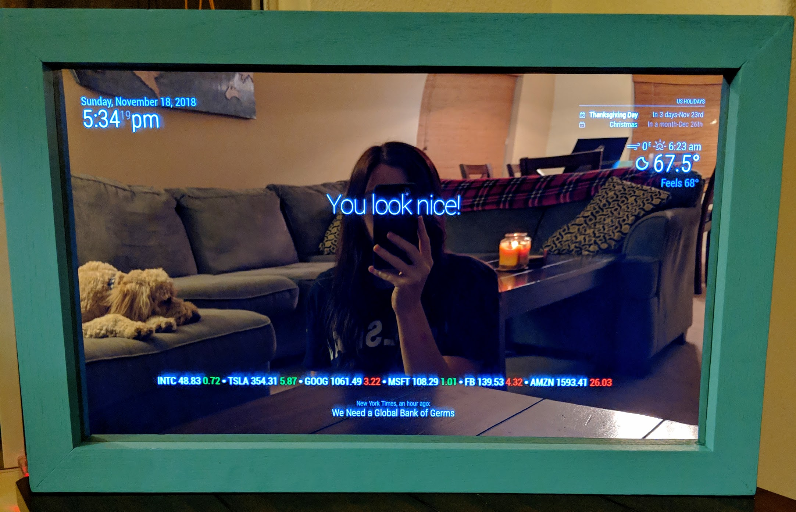

# Mirror-Cle the Magic Mirror
MagicMirror is voted number 1 in the MagPi Top 50 greatest pi projects so I thought that this was a must for a side project!
It took a few days to complete but building something functional from nothing was a rewarding journey in itself. I have to admit that I may have been a little skeptical about using a hand saw for the first time with only YouTube to guide me, but I still have all ten fingers. The end product is very practical and even my non-geek friends think that it looks cool. 

This is my mirror:  

I had a really fun time making this. Because of the MagicMirror open source software provided on GitHub, I didn't get to write a lot of code of my own but that didn't stop me from learning a lot of new skills.

I used the Linux Shell for the first time and got very familiar with Linux commands. The code itself is written in JavaScript so when you edit and customize the configuration files, you are also using JavaScript. My programming experience thus far has been mostly C# so this was a neat change for me. I learned how to remotely connect to my Raspberry Pi from my personal computer through Virtual Network Computing (VNC) and PuTTY. VNC is graphical sharing and this allowed me to see the Mirror screen from my computer. PuTTY is the terminal emulator that I used to configure the mirror setting. Using both of these at the same time, I was able to see and edit the Mirror from my computer which made it more convenient to update and I could edit my Mirror whenever and wherever I wanted.     

This is how I made it.  

* Step 1: Gather Materials
* Step 2: Build Mirror
* Step 3: Configure Raspberry Pi

	* //TODO: add flo-chart module (Goal: Nov 23)
	* //TODO: add commute times (Goal: Nov 24)
